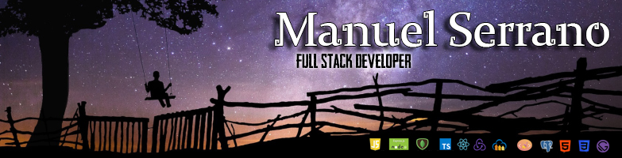

# **Hola, Soy [Manuel Serrano](https://www.linkedin.com/in/manuel-roberto-serrano-torres-436033214/)** 

Soy Informático especializado en desarrollo Web. Cuento con 3 años de experiencia en el área de Tecnología.

Me he formado como desarrollador web por 2 años y he trabajado como mentor en diversas ocasiones en el área de TI.
He creado mis propios proyectos y participando en otros, los cuales comparto en mi GitHub personal.

Estoy interesado en el desarrollo web 🖥️ y moblie 📱 , tanto desde el lado de Front-end como del Back-end.
 

      

 
 

## Mi proyección a futuro 
Me preparo poco a poco para liderar equipos de programadores manteniendo buenas prácticas en el código, e implementar las tecnologías más modernas en el campo.

 

## Lenguajes y herramientas

 

&nbsp;

 

# Para contactarme:

## 📫 Por email: MR_Serrano27@outlook.com

      <a href="https://www.linkedin.com/in/manuel-roberto-serrano-torres-436033214/">
      
      Manuel Serrano
      </a>

  

